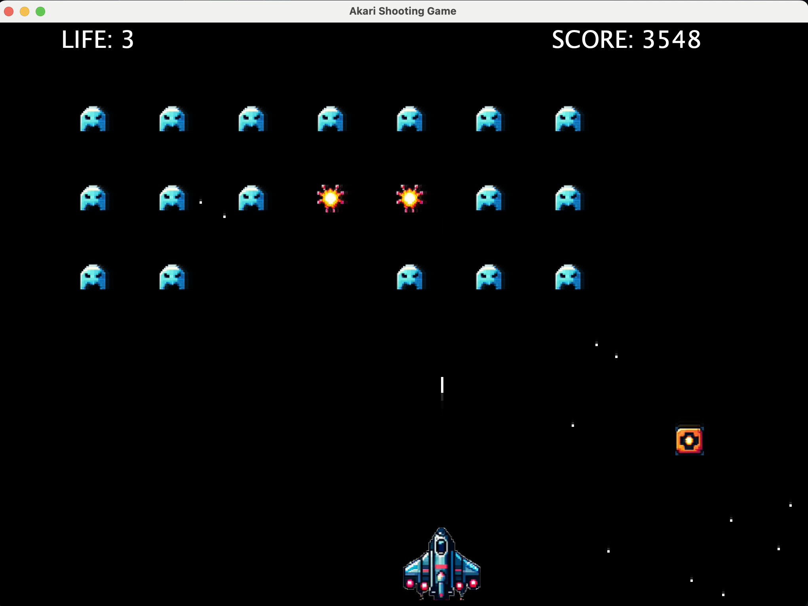

# Akari Shooting Game
# 現在開発中です。 Now under development.


## Description
This is a simple shooting game written in Java.

## Screenshot


## How to play
1. Compile
```
$ javac Game.java
```
2. Run
```
$ java Game
```
3. Enjoy!

## How to control
- Move: Arrow keys
- Shoot: Space key

## License
MIT License (c) 2023 [Akari Takahashi](https://github.com/takahashi-akari)
